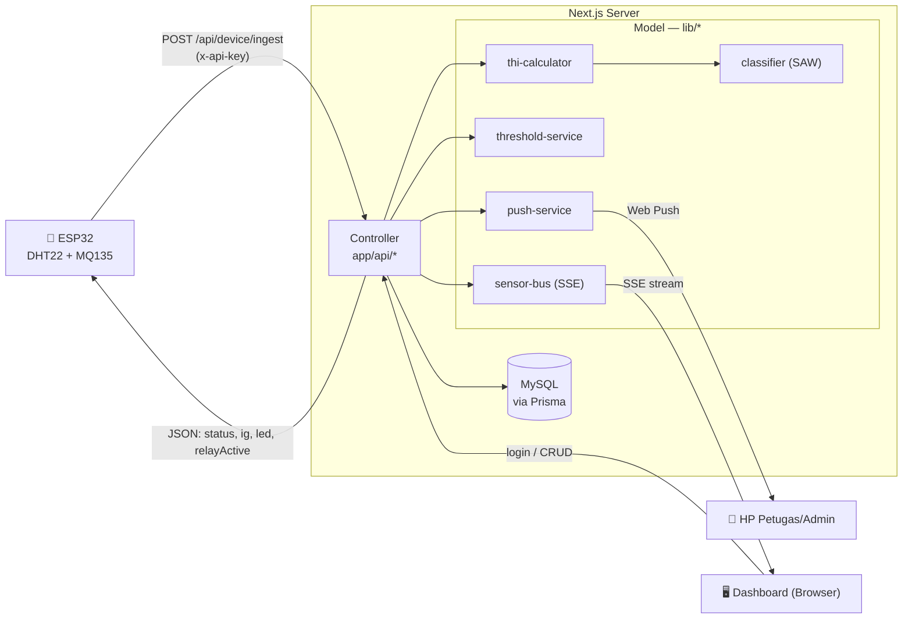
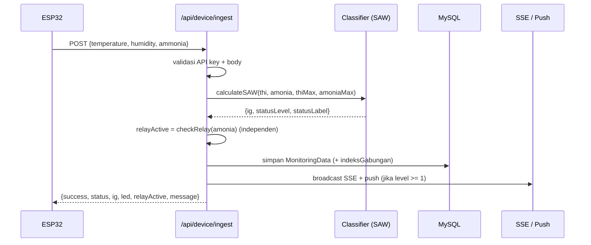
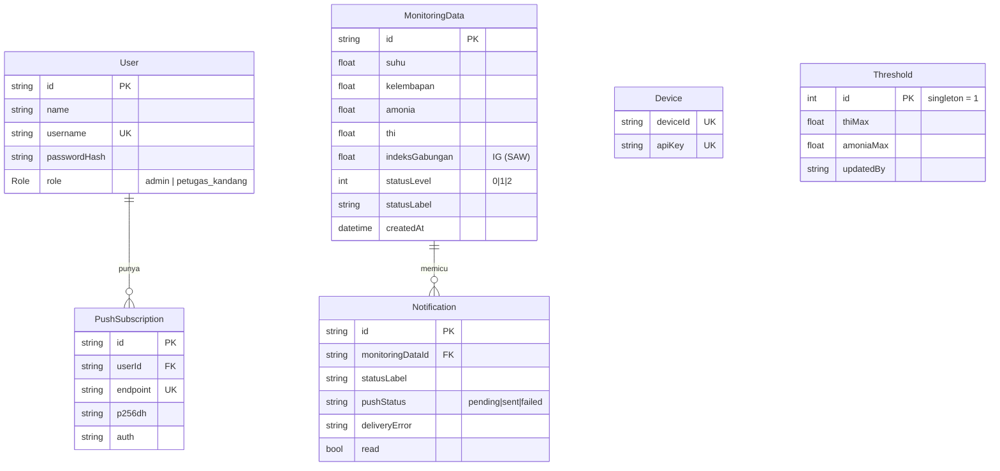

<div align="center">

# 🐄 SLMS — Smart Livestock Monitoring System

**Sistem monitoring lingkungan kandang sapi perah berbasis IoT**
_Implementasi di SMKN 5 Pangalengan — 5 ekor sapi Friesian Holstein_

[](https://nextjs.org/)
[](https://www.typescriptlang.org/)
[](https://www.prisma.io/)
[](https://www.mysql.com/)
[](https://tailwindcss.com/)
[](#-testing-di-hp--pwa)

</div>

---

## 📖 Daftar Isi

- [Tentang Proyek](#-tentang-proyek)
- [Fitur Utama](#-fitur-utama)
- [Tech Stack](#-tech-stack)
- [Arsitektur Sistem](#-arsitektur-sistem)
- [Logika Domain — Metode SAW](#-logika-domain--metode-saw)
- [Skema Database](#-skema-database)
- [Referensi API](#-referensi-api)
- [Memulai (Getting Started)](#-memulai-getting-started)
- [Akun Default](#-akun-default)
- [Testing di HP & PWA](#-testing-di-hp--pwa)
- [Struktur Proyek](#-struktur-proyek)
- [Konteks Perangkat Keras (ESP32)](#-konteks-perangkat-keras-esp32)
- [Lisensi](#-lisensi)

---

## 🎯 Tentang Proyek

SLMS adalah aplikasi web yang memantau kondisi lingkungan kandang sapi perah secara **berkala** (bukan real-time murni) menggunakan sensor pada mikrokontroler **ESP32**. Data suhu, kelembapan, dan amonia dikirim ke server, diklasifikasikan menjadi status kandang **Normal / Waspada / Bahaya** menggunakan metode **Simple Additive Weighting (SAW)**, ditampilkan di dashboard, lalu memicu **notifikasi push** ketika kondisi di luar batas aman.

Proyek ini merupakan implementasi dari skripsi:
> _"Implementasi Smart Livestock Monitoring System Berbasis IoT untuk Optimalisasi Kondisi Lingkungan Kandang Sapi di SMKN 5 Pangalengan."_

**Dua peran pengguna:**
| Peran | Akses |
|-------|-------|
| `admin` | Dashboard lengkap, monitoring detail, kelola threshold & user |
| `petugas_kandang` | Dashboard & monitoring versi sederhana, menerima notifikasi |

---

## ✨ Fitur Utama

- 📊 **Dashboard adaptif per-peran** — tampilan lengkap untuk admin, tampilan sederhana (banner status besar) untuk petugas.
- 🔴 **Live update via Server-Sent Events (SSE)** — kartu status ter-update otomatis tanpa refresh saat data baru masuk.
- 🧮 **Klasifikasi SAW** — 2 kriteria (THI & Amonia), bobot 50:50, terpusat di `classifier.ts`.
- 🔔 **Push Notification native (Web Push + VAPID)** — bukan Firebase; berjalan lewat Service Worker.
- ⚙️ **Threshold admin-configurable** — batas THI & Amonia dapat diubah lewat Settings.
- 📈 **Riwayat & filter** — data historis dengan filter rentang waktu dan grafik tren.
- 🔐 **Autentikasi + role guard** — NextAuth (Credentials) + proxy berbasis peran.
- 📱 **Progressive Web App** — installable, ikon maskable, splash screen tajam.
- 🎨 **UI modern** — bottom-dock liquid glass, toast, modal konfirmasi.

---

## 🛠 Tech Stack

| Kategori | Teknologi |
|----------|-----------|
| Framework | **Next.js 16** (App Router) + React 19 |
| Bahasa | **TypeScript** |
| ORM & DB | **Prisma 7** + **MySQL** (driver adapter `@prisma/adapter-mariadb`) |
| Auth | **NextAuth v5 / Auth.js** (Credentials provider, bcrypt) |
| Styling | **Tailwind CSS v4** + shadcn/ui (Radix) + lucide-react |
| Chart | **Recharts** |
| Realtime | **Server-Sent Events (SSE)** |
| Push | **web-push** (VAPID) + Service Worker |
| Icons/PWA | SVG favicon + manifest + maskable PNG (di-generate via `sharp`) |

---

## 🏗 Arsitektur Sistem

Arsitektur mengikuti pola **MVC** (mirror Class Diagram BAB 3).



**Alur ingest (ringkas):**



---

## 🧮 Logika Domain — Metode SAW

> ⚠️ Ini logika bisnis paling penting dan paling sering dicek saat sidang. Terpusat di [`lib/classifier.ts`](lib/classifier.ts) — **jangan** diduplikasi inline di route.

Klasifikasi memakai **2 kriteria saja — THI & Amonia** — digabung dengan **Simple Additive Weighting** (bobot **50 : 50**).

**1. Hitung THI** (dari suhu & kelembapan):
```
THI = (0.8 × T) + ((RH / 100) × (T − 14.4)) + 46.4
```

**2. Normalisasi** (masing-masing ke indeks 0–100):
```
iThi    = ((thi − 56) / (thiMax − 56)) × 100    → clamp ke 0 jika negatif (thi < 56)
iAmonia = (amonia / amoniaMax) × 100
```

**3. Indeks Gabungan (IG):**
```
IG = (0.5 × iThi) + (0.5 × iAmonia)
```

**4. Klasifikasi status dari IG:**

| Rentang IG | Level | Label | LED |
|------------|:-----:|-------|-----|
| `IG < 25` | 0 | 🟢 **normal** | Hijau |
| `25 ≤ IG < 50` | 1 | 🟡 **waspada** | Kuning |
| `IG ≥ 50` | 2 | 🔴 **bahaya** | Merah |

**Relay independen dari LED/status** — relay hanya mengikuti amonia:
```
relayActive = checkRelay(amonia) = amonia ≥ amoniaMax
```
> Satu pembacaan bisa **Bahaya** (karena THI) dengan relay **OFF**, atau **Normal** dengan relay **ON**. `led` dan `relayActive` tidak saling menentukan.

**Threshold** (keduanya admin-configurable, tidak ada yang hardcode): `thiMax` (> 56) dan `amoniaMax`.

---

## 🗃 Skema Database



---

## 🔌 Referensi API

Base URL: `/api`. Semua endpoint (kecuali `device/ingest` & `auth`) memerlukan sesi login.

<details>
<summary><b>📥 POST <code>/api/device/ingest</code> — ingest data sensor (ESP32)</b></summary>

**Auth:** header `x-api-key: <DEVICE_API_KEY>`

**Request:**
```json
{
  "deviceId": "esp32-barn-01",
  "temperature": 28.91,
  "humidity": 57.92,
  "ammonia": 14.26,
  "timestamp": "2026-06-19T14:42:42Z"
}
```

**Response:**
```json
{
  "success": true,
  "status": "waspada",
  "ig": 37.4,
  "led": "kuning",
  "relayActive": false,
  "message": "Kondisi kandang Waspada"
}
```

> `led` mengikuti status SAW; `relayActive` mengikuti `checkRelay(amonia)` secara terpisah.

</details>

<details>
<summary><b>📊 Monitoring</b></summary>

| Method | Endpoint | Keterangan |
|--------|----------|-----------|
| `GET` | `/api/monitoring/latest` | Pembacaan terbaru |
| `GET` | `/api/monitoring/history?from=&to=` | Data historis pada rentang tanggal |
| `GET` | `/api/stream` | **SSE** — stream pembacaan live |

</details>

<details>
<summary><b>⚙️ Settings (admin)</b></summary>

| Method | Endpoint | Keterangan |
|--------|----------|-----------|
| `GET` / `PUT` | `/api/settings/threshold` | Ambil / simpan `{ thiMax, amoniaMax }` |
| `GET` / `POST` | `/api/settings/user` | Daftar / tambah user |
| `DELETE` | `/api/settings/user/[id]` | Hapus user |

</details>

<details>
<summary><b>🔔 Notifikasi & Push</b></summary>

| Method | Endpoint | Keterangan |
|--------|----------|-----------|
| `GET` | `/api/notifications?jenis=&from=&to=` | Riwayat alert (dengan filter) |
| `PATCH` | `/api/notifications/[id]` | Tandai sudah dibaca |
| `POST` / `DELETE` | `/api/push/subscribe` | Daftar / hapus subscription push |

</details>

---

## 🚀 Memulai (Getting Started)

### Prasyarat
- **Node.js ≥ 20.19**
- **MySQL** berjalan lokal (atau remote)

### 1. Clone & install
```bash
git clone <repo-url>
cd slms
npm install
```

### 2. Konfigurasi environment
Salin `.env.example` menjadi `.env`, lalu isi nilainya:
```bash
cp .env.example .env
```
Generate VAPID keys untuk push notification, isikan ke `VAPID_PUBLIC_KEY`, `VAPID_PRIVATE_KEY`, dan `NEXT_PUBLIC_VAPID_PUBLIC_KEY`:
```bash
npx web-push generate-vapid-keys
```
Generate `AUTH_SECRET`:
```bash
npx auth secret     # atau: openssl rand -base64 32
```

### 3. Migrasi & seed database
```bash
npx prisma migrate deploy   # terapkan migrasi
npx prisma db seed          # buat akun default + device
```

### 4. Jalankan
```bash
npm run dev                 # http://localhost:3000
npm run dev -- -H 0.0.0.0   # agar bisa diakses dari HP di jaringan sama
```

### Build produksi
```bash
npm run build && npm start
```

---

## 👤 Akun Default

Dibuat oleh [`prisma/seed.ts`](prisma/seed.ts):

| Username | Password | Peran |
|----------|----------|-------|
| `admin` | `admin123` | admin |
| `petugas1` | `petugas123` | petugas_kandang |

Device seed: `deviceId = esp32-barn-01` (apiKey diambil dari `DEVICE_API_KEY`).

> ⚠️ Ganti password default sebelum digunakan di lingkungan nyata.

---

## 📱 Testing di HP & PWA

<details>
<summary><b>Akses dari HP tanpa deploy</b></summary>

1. HP & laptop di **Wi-Fi yang sama**.
2. Jalankan `npm run dev -- -H 0.0.0.0`, buka `http://<IP-LAN>:3000` di HP.
3. Tambahkan IP LAN ke `allowedDevOrigins` di `next.config.ts` (Next 16 memblokir origin dev lain).
4. Set `AUTH_TRUST_HOST=true` di `.env` agar login jalan lewat IP.

</details>

<details>
<summary><b>⚠️ Push Notification butuh HTTPS</b></summary>

Service Worker & Push API hanya aktif di **secure context** (HTTPS / `localhost`). Untuk test push di HP tanpa hosting, gunakan tunnel:
```bash
cloudflared tunnel --url http://localhost:3000
```
Buka URL `https://xxxx.trycloudflare.com` di HP. SSE (auto-refresh) tetap jalan via HTTP LAN biasa.

</details>

<details>
<summary><b>🎨 Progressive Web App (PWA)</b></summary>

Manifest di [`app/manifest.ts`](app/manifest.ts) + ikon maskable 512px (`public/icons/`) → splash screen tajam saat di-install. Favicon dari [`app/icon.svg`](app/icon.svg).

</details>

---

## 📂 Struktur Proyek

```
slms/
├─ app/
│  ├─ (auth)/login/          # halaman login (neumorphic)
│  ├─ (dashboard)/           # dashboard, monitoring, alerts, settings
│  ├─ api/                   # route handlers (controller)
│  ├─ icon.svg               # favicon
│  ├─ manifest.ts            # PWA manifest
│  └─ layout.tsx
├─ components/               # UI (TopBar, BottomNav, cards, dialogs, toast…)
├─ lib/                      # MODEL: classifier, thi-calculator,
│                            #   threshold-service, push-service, sensor-bus,
│                            #   prisma, format-date, status-reason
├─ prisma/
│  ├─ schema.prisma
│  ├─ migrations/
│  └─ seed.ts
├─ public/
│  ├─ sw.js                  # service worker (push handler)
│  └─ icons/                 # PWA icons
├─ auth.ts                   # NextAuth config
├─ proxy.ts                  # middleware (route/role guard, Next 16)
└─ next.config.ts
```

**Self-check logika** (tanpa framework tes):
```bash
npx tsx lib/classifier.check.ts     # verifikasi perhitungan SAW
npx tsx lib/sensor-bus.check.ts     # verifikasi fan-out SSE
```

---

## 🔧 Konteks Perangkat Keras (ESP32)

<details>
<summary>Detail pin & sensor (firmware terpisah, di luar repo ini)</summary>

- **MCU:** ESP32
- **DHT22** (suhu & kelembapan) — GPIO 27
- **MQ135** (amonia) — GPIO 34 (ADC), R0 ≈ 9.45, kalibrasi `getPPM()`. Output 5V → voltage divider 10kΩ/15kΩ ke 3.3V.
- **LCD** IPS TFT 1.47" ST7789 (172×320) — SPI: MOSI=23, SCLK=18, CS=5, DC=2, RST=4, BL=15
- **Relay** 1-channel — GPIO 26 (future automatic barn cleaning equipment)
- **LED** Hijau=25, Kuning=33, Merah=32

Monitoring bersifat **berkala**, bukan real-time murni.

</details>

---

## 📄 Lisensi

Proyek ini dikembangkan untuk keperluan **akademik (skripsi)** — SMKN 5 Pangalengan. Penggunaan di luar konteks tersebut mohon menghubungi pemilik repositori terlebih dahulu.

---

<div align="center">

Dibuat dengan 💚 untuk peternakan sapi perah SMKN 5 Pangalengan

</div>
